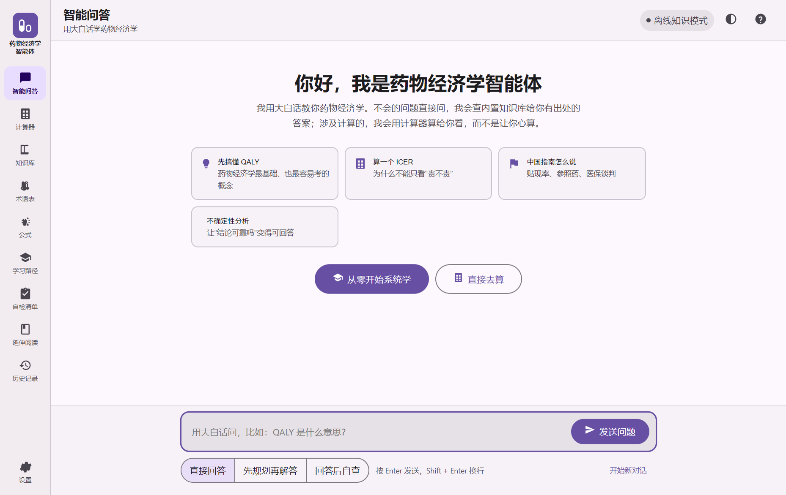
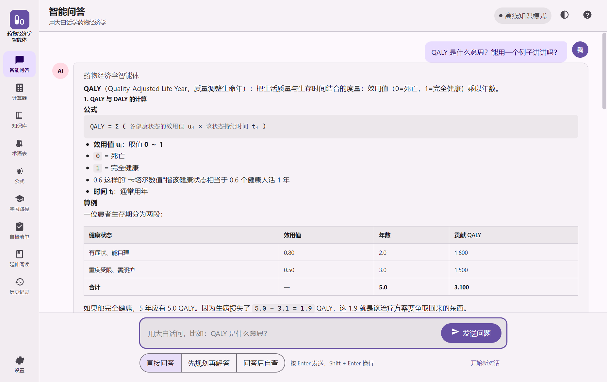
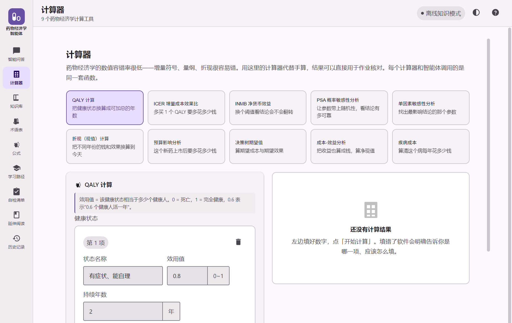
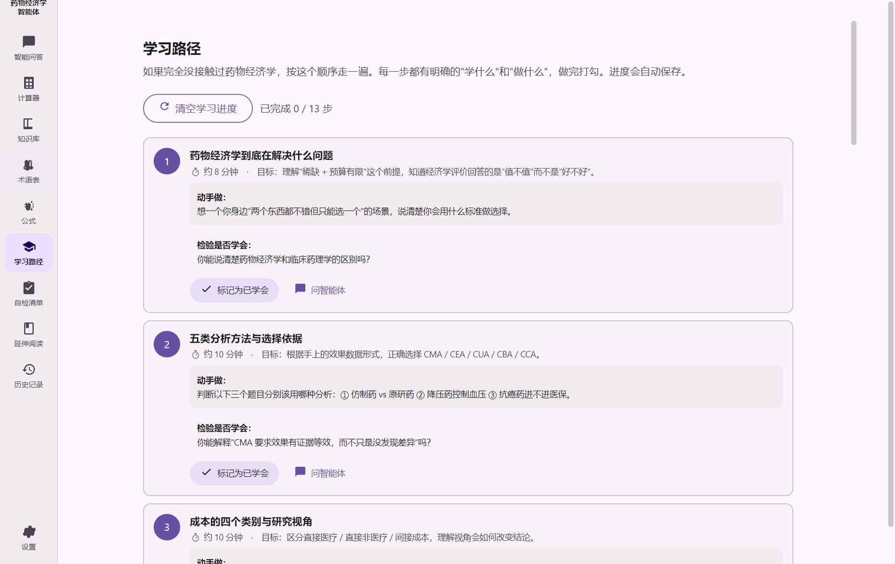
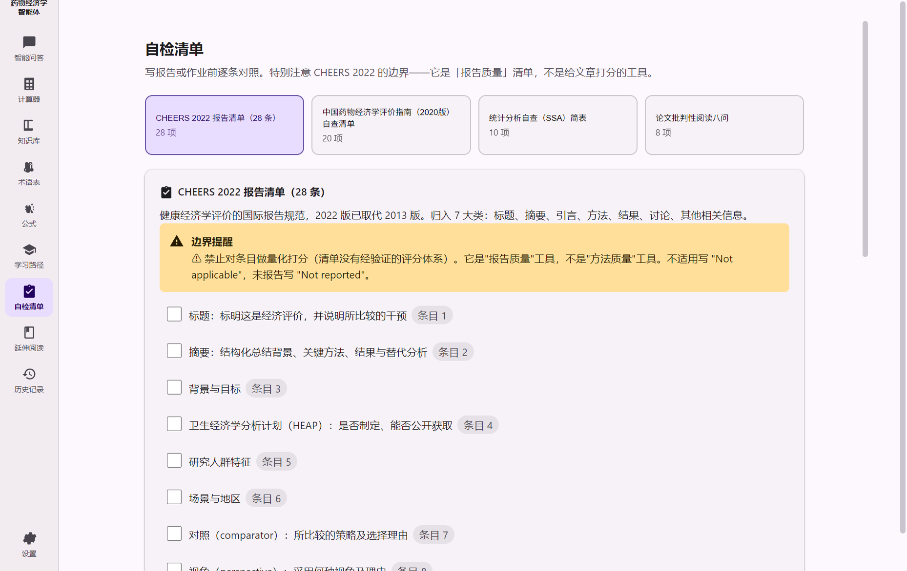
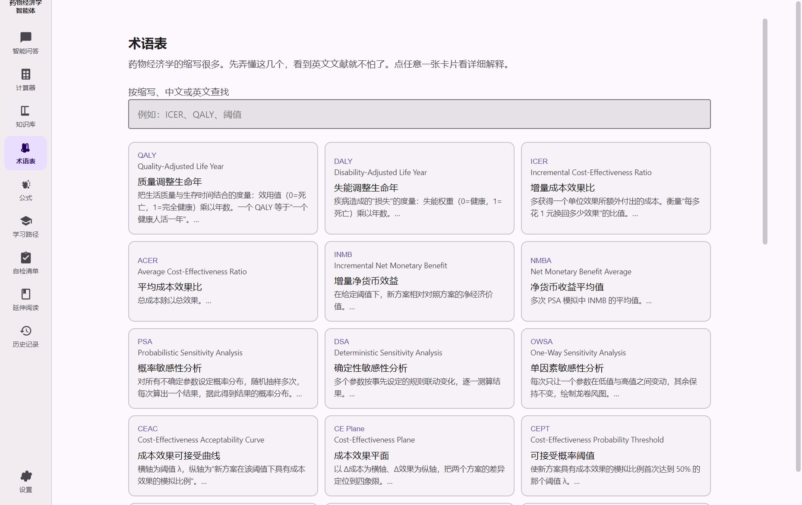
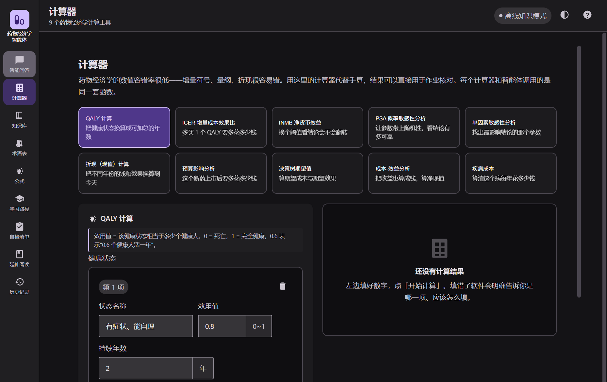

<div align="center">


# 药物经济学智能体

**面向药学与经济学专业学生的零配置学习与计算助手**

[](https://github.com/leerogerstheman/PharmaEconAgent/releases)
[](./LICENSE)
[](https://electronjs.org)
[](https://m3.material.io/)
[](https://www.microsoft.com/windows)

**下载即用：不需要安装 Python、pip、数据库、Node.js，也不需要联网。**

</div>

---

## 这个软件解决什么问题

药物经济学的数值容错率极低 —— 增量符号、量纲、折现率随手就能算错；而概念又高度抽象，缩写满天飞。传统做法是翻教材、问同学、手算，效率低。

这个软件把三件事合到一起：

| | 解决什么 |
| --- | --- |
| **会讲人话的问答** | 用大白话提问，回答来自内置知识库，**每条都标注出处**，可以回溯原始文献 |
| **不会算错的计算器** | 9 个药经计算工具，**不经过大模型心算**，全部是确定性函数 |
| **零基础的学习路径** | 13 步从"药经在解决什么问题"到"完整评估一个新药"，进度自动保存 |

---

## 下载

<table>
<tr><td width="50%">

**普通用户（推荐）**

1. 打开 [Releases 页面](https://github.com/leerogerstheman/PharmaEconAgent/releases)
2. 下载 `药物经济学智能体-v1.0.0-完整包.zip`
3. 解压，**双击 `药物经济学智能体.exe`**
4. 等 3～10 秒，窗口打开就能用

> Windows 可能提示"已保护你的电脑" → 点「更多信息」→「仍要运行」。
> 软件没有购买商业代码签名证书，不是病毒。

</td><td width="50%">

**开发者**

```bash
git clone https://github.com/leerogerstheman/PharmaEconAgent.git
cd PharmaEconAgent
npm install
npm run dist                      # 产物：release/药物经济学智能体.exe
node scripts/make-release.js      # 组装完整发布目录
```

</td></tr>
</table>

**只要单个 exe 的用户**：下载 `药物经济学智能体.exe`（69 MB）即可，完整包含运行时，无需安装任何东西。

---

## 界面

### 智能问答



<p align="center"></p>

回答下方有可点击的追问按钮，不用打字；每条内容都标注了来源。

### 计算器



点「开始计算」后给出**结论、公式、成本效果平面位置、明细表格**，并附「怎么理解这个结果」的讲解。

> 这里有个刻意的设计：被支配方案（新方案更贵**且**更差）会被强制判定为「不应采用」，
> 无论 ICER 算出来多好看。这是学生最常犯的错误，所以拦在工具层面而不是只在文档里提一句。

### 学习路径与自检清单

<p align="center">


</p>

<p align="center">


</p>

---

## 功能一览

| 模块 | 内容 |
| --- | --- |
| **智能问答** | 三种模式：直接回答 / 先规划再解答 / 回答后自查；可查看思考过程（工具调用记录） |
| **计算器** | QALY、ICER、INMB、PSA、单因素敏感性、折现、预算影响、决策树、成本-效益、疾病成本 |
| **知识库** | 15 个主题的深度条目，按入门/进阶/高级分层，可展开全文与原始出处 |
| **术语表** | 32 个核心术语与缩写，含定义、公式、注意、来源 |
| **公式速查** | 15 个常用公式，每个都配算例与单位说明 |
| **学习路径** | 13 步课程，每步有「学什么」「动手做」「检验是否学会」 |
| **自检清单** | CHEERS 2022（28 条）、中国指南清单、统计分析清单、论文批判性阅读八问 |
| **延伸阅读** | 15 项书籍与原始文献，按重要程度排序 |
| **运行自检** | 一键检查 17 项关键路径，结果落盘为日志供报障使用 |

---

## 三个设计来源

| 维度 | 来源 | 落地方式 |
| --- | --- | --- |
| Agent 架构 | [Datawhale《Hello-Agents》](https://github.com/datawhalechina/hello-agents) 与 [HelloAgents 框架](https://github.com/jjyaoao/helloagents) | 按 `core/ tools/ context/ agents/ memory/ observability/ skills/` 分层移植（对照表见下） |
| 知识库 | [Wikipedia: Pharmacoeconomics](https://en.wikipedia.org/wiki/Pharmacoeconomics)、CHEERS 2022、中国药物经济学评价指南（2020 中英双语版）、NICE PMG36、WHO 2003、ISPOR、EVIDEM、Drummond 教材 | 15 篇深度语料 + 32 术语 + 15 公式，每条标注出处 |
| 界面 | [Material Design 3](https://m3.material.io/) | 完整 M3 令牌体系，并针对非技术用户加固 |

### HelloAgents 架构移植对照

| HelloAgents（Python） | 本项目（JavaScript / Electron） |
| --- | --- |
| `core/llm.py` + `core/llm_adapters.py` | `src/core/llm.js` + `src/core/llm-adapters.js` —— 三协议适配，保留按 `base_url`+`key` 自动识别 provider |
| `core/agent.py` | `src/core/agent.js` —— Function Calling 主循环，含步数保护、熔断、流式事件、埋点 |
| `tools/response.py` | `src/tools/registry.js` 的 `ToolResponse` —— 失败也返回可被模型看见的文本以便自我修正 |
| `tools/registry.py` / `tool_filter.py` | `ToolRegistry` + `ToolRegistryLike`（子代理白名单） |
| `tools/circuit_breaker.py` | `src/tools/circuit-breaker.js` |
| `context/*` | `src/context/{token-counter,history,truncator,builder}.js` |
| `agents/{react,plan_solve,reflection}_agent.py` | `src/agents/index.js` 的三个 Agent + 药物经济学领域提示词 |
| `core/session_store.py` | `src/memory/session-store.js` —— **改用 JSON 文件而非 SQLite**（零安装硬约束） |
| `observability/trace_logger.py` | `src/observability/trace-logger.js` |
| `skills/loader.py` | `src/skills/loader.js` —— 可由用户在 exe 旁的 `skills/` 目录自行增补 |

---

## 领域能力

15 个工具，其中 **10 个为确定性计算**，不经过大模型心算：

```
QALY 计算 · ICER · INMB · PSA · 单因素敏感性分析 ·
折现 · 预算影响分析 · 决策树期望值 · 成本-效益 · 疾病成本
```

### 几处刻意的设计决策

**1. PSA 使用可播种的确定性 PRNG（mulberry32）**
同 `seed` + 同参数必然得到同一结果。教学场景下学生要反复调参观察曲线怎么动，
如果结果每次都不同，他们会怀疑软件在乱数、也就无法把"变化"归因到参数本身。

**2. 强制方法学约束：先判象限，再谈阈值**
`calc_icer` 的判定顺序固定为「平面象限 → 象限语义 → 阈值比较」，工具层面不允许跳过第一步。
当 `ΔE<0 且 ΔC>0`（西南象限，被对照方案完全支配）时，直接判定「不应采用」——
此时 ICER 可能算出一个"看起来不错"的负数，但那是负数除法的假象。

**3. 中文检索不引入分词库**
采用「一元 + 二元」组合切分。实测对 `QALY` `ICER` `PSA` 这类专业缩写召回良好，
且省掉了一个体积可观的依赖。

**4. 问句净化 + 字段加权检索**
「QALY 是什么意思？能用一个例子讲讲吗？」里的"是什么意思/举个例子"会生成大量
无意义中文二元组，实测会把无关文档排到第一（问 QALY 曾把"方法学陷阱清单"排第一）。
`normalizeQuery()` 先剥离套话；同时用三路 BM25（标题别名 ×3.2 / 标签 ×1.6 / 正文 ×1），
让专有名词命中标题时压过仅正文偶然命中的文档。

---

## 零安装是怎么做到的

| 约束 | 做法 |
| --- | --- |
| 不装 Python / pip | 全栈 JavaScript，Electron 自带 Node 运行时 |
| 不装数据库 | 知识库 = 单个 JSON；检索 = 内存 BM25；会话 = JSON 文件 |
| 不装 Node | 打包为 portable exe，运行时含全部依赖 |
| 不需要联网 | 默认离线模式，问答走内置检索式引擎，**有依据且标注出处** |
| 不需要配置 | `offline` 是默认 provider；API Key 为可选增强 |

### 离线 ≠ 弱化

没有 API Key 时走 `OfflineEngine`：
意图识别（6 类）→ 字段加权检索 + 意图先验 → 结构化组装（直答 + 知识条目 + 出处 + 提示 + 可点击追问）。

**它不会编造数字** —— 所有内容都来自知识库条目，每条都带 `source` / `url`。

想获得更自然的讲解，可在「设置」里填 API Key，支持 DeepSeek、通义千问、Kimi、智谱、
SiliconFlow 等任意 OpenAI 兼容服务，也可选本机 Ollama 完全离线运行。Key 只存在本机。

---

## 界面：M3 + 面向零基础用户的加固

严格遵循 M3 令牌（角色化色彩、type scale、shape scale、elevation 0–5、motion tokens、state layer），
并做以下**超出规范的加固**：

| 项 | M3 规范 | 本项目 | 原因 |
| --- | --- | --- | --- |
| 触控目标 | 48dp | 按钮 48px，主操作 56px | 目标用户不熟悉精细操作 |
| 正文字号 | 16px | **17px** | 长时间阅读中文的舒适下限 |
| 描边 | 1px | **2px** | 高对比环境下更清晰 |
| hover 状态层 | 8% | **10%** | 变化更易察觉 |
| disabled 内容 | 38% | **45%** | 太淡等于看不见 |
| 导航栏 | 80dp | **96dp** | 容纳中文字标签不换行 |
| 图标 | Material Symbols | **内联 SVG + 强制文字标签** | 字体图标无障碍差；纯图标控件对非技术用户是理解障碍 |

唯一允许"只有图标没有文字"的控件是关闭/主题/帮助按钮，且都带 `aria-label` + Tooltip。
输入框使用**常驻标签**（不用 placeholder 代替），状态变化必须有文字说明（不只靠颜色）。

---

## 工程细节

### portable 单文件模式的一个坑

NSIS 自解压启动器会把应用解到 `%TEMP%\XXXX\` 再运行，此时
`__dirname`、`app.getPath('exe')`、`process.execPath` **全部指向临时目录**。
如果照它们定位「我的报告」，用户导出的报告会在系统清理临时目录时一起消失。

`resolveExeDir()` 优先使用 electron-builder 启动器设置的 `PORTABLE_EXECUTABLE_DIR`。
这个 bug 是被**启动自检**抓出来的，自检会检查 `exeDir` 是否意外落在 `%TEMP%` 下，
并对报告目录做真实写入探测。

### 安全设计

渲染进程完全禁用 Node（`contextIsolation` + `sandbox`），
所有能力通过 `preload.js` 暴露的 25 个具名方法访问。知识库内容与模型输出都视为不可信输入：

- Markdown 渲染前统一 HTML 转义，杜绝 XSS
- CSP 限制 `default-src 'none'`
- 外链一律交给系统浏览器，应用内拒绝导航
- 配置损坏时退回离线模式，而不是崩溃

### 验证

| 项目 | 结果 |
| --- | --- |
| 端到端自检（真实 Electron 窗口） | **43 / 43** |
| 打包版启动自检 | **17 / 17** |
| 教学算例执行 | 8 / 8 |
| PSA 可复现性 | 同 seed 必得同结果 |
| 方法学反向验证 | 被支配方案不会被判为"具有成本效果" |
| 密钥扫描 | 60 个源文件无命中 |

---

## 开发命令

```bash
npm run kb         # 重建知识库 → dist/kb.json
npm run icon       # 重新生成应用图标（零依赖 PNG 编码器）
npm run dev        # 开发模式运行
npm run selftest   # 43 项端到端自检
npm run shots      # 生成界面截图（内置导航高亮自校验）
npm run dist       # 打包 → release/药物经济学智能体.exe
```

---

## 目录结构

```
PharmaEconAgent/
├── src/
│   ├── core/        LLM 适配 + Agent 基类
│   ├── agents/      ReAct / Plan-and-Solve / Reflection
│   ├── tools/       ToolResponse / Registry / CircuitBreaker / 15 个内置工具
│   ├── context/     TokenCounter / HistoryManager / Truncator / Builder
│   ├── rag/         中文 BM25（无分词库）
│   ├── knowledge/   知识库加载 + 离线问答引擎
│   ├── domain/      药物经济学数学内核（纯函数、可复现）
│   ├── memory/ observability/ skills/
│   └── main/        Electron 主进程 / IPC / preload / 启动自检
├── renderer/        前端（M3 设计令牌 + 组件 + 视图）
├── knowledge/       语料 Markdown + 结构化数据
├── docs/            界面截图与图标
└── scripts/         构建、自检、发布脚本
```

---

## 致谢与许可

本项目为独立实现，未包含 Hello-Agents / HelloAgents 框架的源代码，
其**架构设计思路**参考了上述项目（CC BY-NC-SA 4.0）。

知识库内容综合整理自 Wikipedia（CC BY-SA 4.0）、《中国药物经济学评价指南（2020 中英双语版）》
（ISBN 9787509219171 / T/CPHARMA 003-2020）、CHEERS 2022（BMJ 2022;376:e067975）、
NICE PMG36、WHO《Making Choices in Health》(2003)、EVIDEM 框架（Goetghebeur 等 2008）、
ISPOR Good Practices、Drummond 等《Methods for the Economic Evaluation of Health Care Programmes》。
完整清单见 [LICENSE](./LICENSE)，每条知识库条目在软件内亦可查看其独立出处。

界面遵循 [Material Design 3](https://m3.material.io/) 规范。

> **本软件为学习辅助工具，不构成医疗、用药或医保决策建议。**
> 知识库中的阈值与政策数字可能随更新而变化，正式引用请以原始指南与文献为准。
